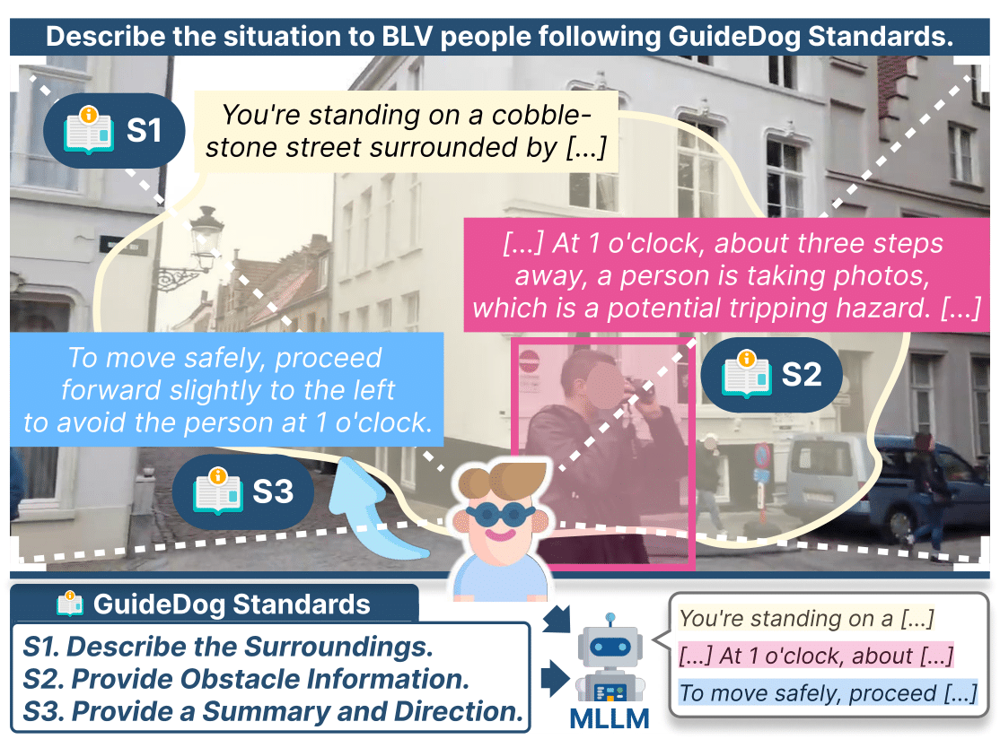

# GuideDog: A Real-World Egocentric Multimodal Dataset for Blind and Low-Vision Accessibility-Aware Guidance

<p align="left" style="text-align: center;">
    <a href='https://junhyeok.kim/' target='_blank'>Junhyeok Kim</a>&emsp;
    Jaewoo Park&emsp;
    Junhee Park&emsp;
    Sangeyl Lee&emsp;
    <a href='https://jiwanchung.github.io/' target='_blank'>Jiwan Chung</a>&emsp;
    Jisung Kim&emsp;
    Ji Hoon Joung&emsp;
    <a href='https://mirlab.yonsei.ac.kr/' target='_blank'>Youngjae Yu</a>
</p>

[](https://arxiv.org/abs/2503.12844)
[](https://huggingface.co/datasets/placeholder)

<br>

## Under Construction 🚧

We are currently preparing the dataset and code for public release. We appreciate your patience!


<p align="center">
  
</p>


## Citation
```
@misc{kim2025guidedogrealworldegocentricmultimodal,
      title={GuideDog: A Real-World Egocentric Multimodal Dataset for Blind and Low-Vision Accessibility-Aware Guidance}, 
      author={Junhyeok Kim and Jaewoo Park and Junhee Park and Sangeyl Lee and Jiwan Chung and Jisung Kim and Ji Hoon Joung and Youngjae Yu},
      year={2025},
      eprint={2503.12844},
      archivePrefix={arXiv},
      primaryClass={cs.CV},
      url={https://arxiv.org/abs/2503.12844}, 
}
```
