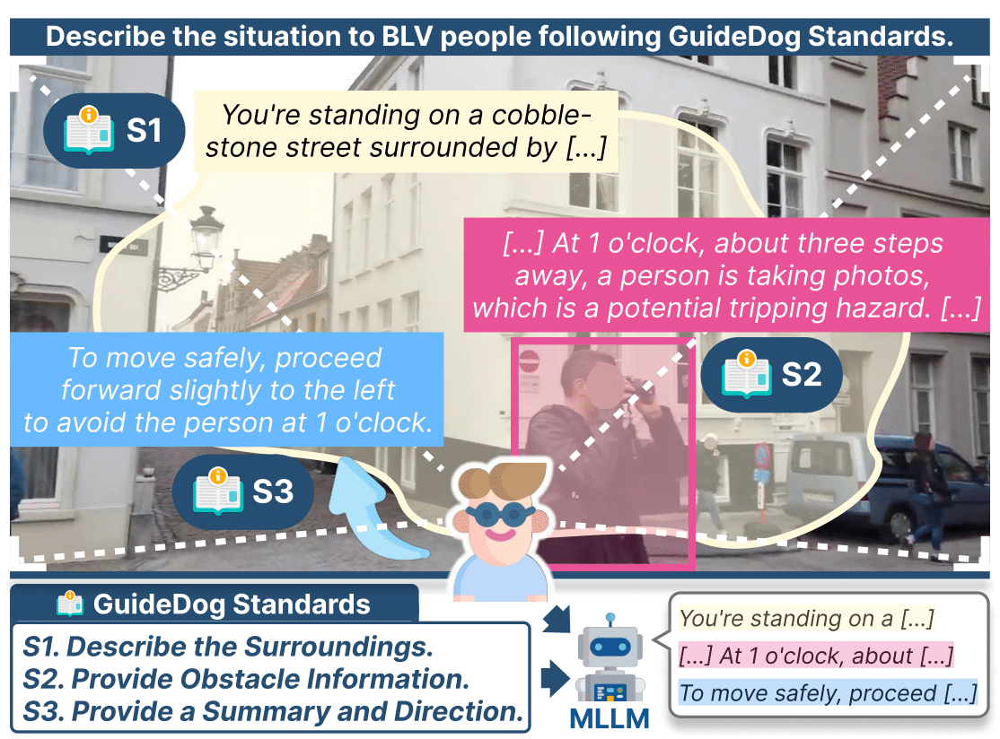

# GuideDog: A Real-World Egocentric Multimodal Dataset for Blind and Low-Vision Accessibility-Aware Guidance

<p align="left">
    <a href='https://junhyeok.kim/' target='_blank'>Junhyeok Kim</a>*&emsp;
    <a href='https://jerife.org/cv' target='_blank'>Jaewoo Park</a>*&ensp;
    Junhee Park&ensp;
    Sangeyl Lee&ensp;
    <a href='https://jiwanchung.github.io/' target='_blank'>Jiwan Chung</a>&ensp;
    Jisung Kim&ensp;
    Ji Hoon Joung&ensp;
    Youngjae Yu
</p>

<p align="left"><sub>* Equal contribution &nbsp;·&nbsp; ACL 2026 (Main)</sub></p>

[](https://arxiv.org/abs/2503.12844)
[](https://huggingface.co/datasets/kjunh/GuideDog)
[](#license)

<p align="center">
  
</p>

## Overview

**GuideDog** is a real-world egocentric multimodal dataset for accessibility-aware guidance for blind and low-vision (BLV) users. The dataset contains **22,084 image–description pairs** (2,106 human-verified *gold* and 19,978 VLM-generated *silver*) collected from real walking videos across diverse cities, plus two derived multiple-choice subsets — **depth** (relative-distance reasoning, 383 questions) and **object** (object-grounded reasoning, 435 questions).

This repository is the **reproduction harness** for the paper. It is a focused fork of [`lmms-eval`](https://github.com/EvolvingLMMs-Lab/lmms-eval) that adds the GuideDog evaluation tasks; everything else in the repo is upstream `lmms-eval`. The companion HuggingFace dataset and this repo are the only artifacts you need to reproduce the paper's eval numbers.

## Dataset

The dataset lives at [`kjunh/GuideDog`](https://huggingface.co/datasets/kjunh/GuideDog) (CC BY-NC 4.0, auto-approve access gate). Three configs:

| Config    | Split  | Rows   | Use                                       |
|-----------|--------|-------:|-------------------------------------------|
| `default` | gold   |  2,106 | Human-verified guidance — eval split      |
| `default` | silver | 19,978 | VLM-generated guidance — training split   |
| `depth`   | train  |    383 | Relative-distance MCQA                    |
| `object`  | train  |    435 | Object-grounded MCQA                      |

```python
from datasets import load_dataset
gold   = load_dataset("kjunh/GuideDog",           split="gold")
silver = load_dataset("kjunh/GuideDog",           split="silver")
depth  = load_dataset("kjunh/GuideDog", "depth",  split="train")
obj    = load_dataset("kjunh/GuideDog", "object", split="train")
```

A HuggingFace token is required (the dataset is gated with auto-approval). Set `HF_TOKEN` in your environment or run `huggingface-cli login`.

## Installation

Python 3.10+ recommended. From a clean virtual environment:

```bash
git clone git@github.com:jun297/GuideDog.git
cd GuideDog
pip install -e .
```

Optional extras for specific model families:

```bash
pip install -e ".[qwen]"      # Qwen-VL utilities
pip install -e ".[gemini]"    # Gemini API
pip install -e ".[all]"       # everything
```

A reference Dockerfile and `docker-compose.yml` are included for containerized eval. See `.env.example` for environment variables (`HF_TOKEN`, `OPENAI_API_KEY`, `HF_CACHE`, `DATASET_DIR`).

## Quickstart: reproduce a single eval

The paper reports numbers across multiple models and seven tasks. Below is a minimal end-to-end command that reproduces the **object MCQA** result for one model:

```bash
python -m accelerate.commands.launch -m lmms_eval \
    --model qwen2_5_vl \
    --model_args pretrained=Qwen/Qwen2.5-VL-7B-Instruct \
    --tasks guidedog_object \
    --batch_size 1 \
    --output_path ./logs/
```

For the open-ended generation tasks (which include the `GPTScore` metric), set `OPENAI_API_KEY` first:

```bash
export OPENAI_API_KEY=sk-...
python -m accelerate.commands.launch -m lmms_eval \
    --model qwen2_5_vl \
    --model_args pretrained=Qwen/Qwen2.5-VL-7B-Instruct \
    --tasks guidedog_0shot \
    --batch_size 1 \
    --output_path ./logs/
```

## Tasks

| Task name                     | Config × split          | Metrics                                                    |
|-------------------------------|-------------------------|------------------------------------------------------------|
| `guidedog_0shot`              | default × gold          | BLEU, Rouge-{1,2,L,Lsum}, METEOR, BERTScore, GPTScore      |
| `guidedog_3shot`              | default × gold          | (same)                                                     |
| `guidedog_socratic_0shot`     | default × gold          | (same)                                                     |
| `guidedog_socratic_3shot`     | default × gold          | (same)                                                     |
| `guidedog_depth_closer`       | depth × train           | accuracy                                                   |
| `guidedog_depth_farther`      | depth × train           | accuracy                                                   |
| `guidedog_object`             | object × train          | accuracy                                                   |

Use `--tasks task1,task2,...` to evaluate several at once.

## Citation

```bibtex
@inproceedings{kim2026guidedog,
    title     = {GuideDog: A Real-World Egocentric Multimodal Dataset for Blind and Low-Vision Accessibility-Aware Guidance},
    author    = {Kim, Junhyeok and Park, Jaewoo and Park, Junhee and Lee, Sangeyl and Chung, Jiwan and Kim, Jisung and Joung, Ji Hoon and Yu, Youngjae},
    booktitle = {Proceedings of the 64th Annual Meeting of the Association for Computational Linguistics},
    year      = {2026}
}
```

## License

Dual-licensed, matching the upstream `lmms-eval` convention:

- **MIT** for the original `lmms-eval` pipeline (everything outside `lmms_eval/tasks/guidedog*`).
- **Apache 2.0** for the GuideDog task code in `lmms_eval/tasks/guidedog`, `lmms_eval/tasks/guidedog_depth`, and `lmms_eval/tasks/guidedog_object`.

The dataset itself (`kjunh/GuideDog`) is released under **CC BY-NC 4.0** for non-commercial research use.

## Acknowledgements

This evaluation pipeline is built on top of [`lmms-eval`](https://github.com/EvolvingLMMs-Lab/lmms-eval) by EvolvingLMMs-Lab. We thank the authors and contributors of that project.
